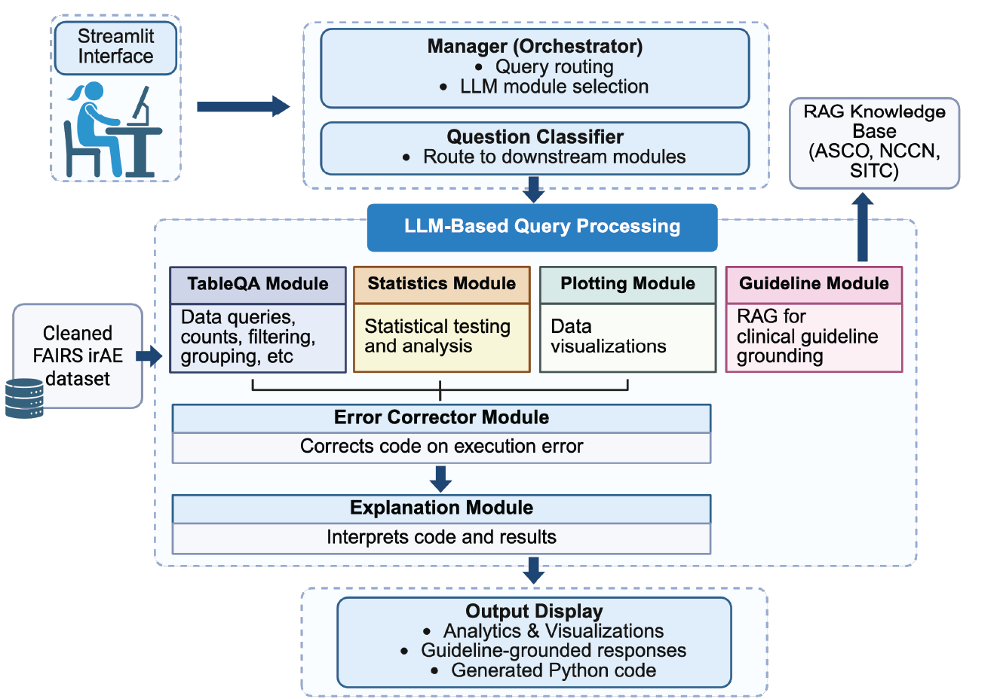

# Python_irAE_LLM_Query

# AI-Enabled Exploration of Immune-Related Adverse Events (irAEs)

An LLM-powered interactive analytics platform for exploring real-world immune-related adverse events from FAERS.

🌐 **Live Application:** https://irae.ai.tanlab.org/  
💻 **Web App Repository:** https://github.com/GabrielaFort/Python_irAE_LLM_Query  

---

## Overview

This project presents an **AI-enabled platform** for interactive exploration of irAEs derived from the FDA Adverse Event Reporting System (FAERS). The system combines:

1. A curated, oncology-specific FAERS dataset (2012Q4–2025Q3)
2. A large language model (LLM)-powered analytics assistant
3. A retrieval-augmented generation (RAG) module grounded in clinical guidelines

The goal is to lower the technical barrier to complex pharmacovigilance analyses while maintaining transparency, reproducibility, and safety.

---

## Key Features

### Curated Oncology-Specific FAERS Dataset

- 71,175 deduplicated ICI-treated irAE cases  
- 60 cancer types  
- 11 ICI agents (anti-PD-1, anti-PD-L1, anti-CTLA-4, anti-LAG-3)  
- Standardized tumor types, drug names, and irAE categories  
- Time-to-onset calculation where available  
- Identification of combination therapy and co-occurring irAEs  

> Note: FAERS is a spontaneous reporting system. Counts reflect reported cases, not incidence rates.

---

### LLM-Powered Natural Language Analytics

Users can ask questions in plain English, such as:

- "How many melanoma patients treated with anti-PD-1 developed colitis?"
- "Compare pneumonitis proportions between lung cancer and melanoma."
- "Run a chi-square test comparing colitis proportions across drug classes."
- "Create a heatmap of irAE proportions by tumor type."
- "Tell me how immune-mediated pneumonitis is graded and treated."

The system automatically:

- Classifies user intent (`tableqa`, `stats`, `plot`, `guideline`)
- Generates executable Python code
- Executes code in a secure sandbox
- Returns structured outputs and figures
- Displays the generated code for transparency

---

### Guideline-Grounded Clinical Responses (RAG)

Clinical questions about irAE management are answered using retrieval-augmented generation (RAG), grounded strictly in:

- ASCO guidelines  
- NCCN guidelines  
- SITC guidelines  

Responses are citation-aware and limited to retrieved guideline content to minimize hallucination risk.

---

## System Architecture

